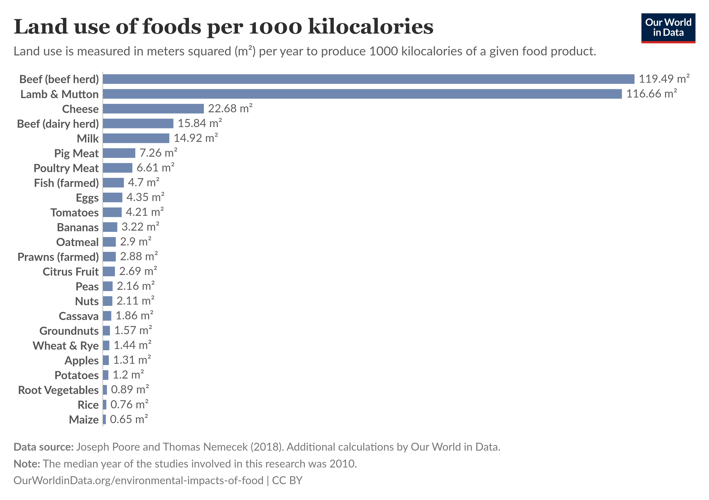
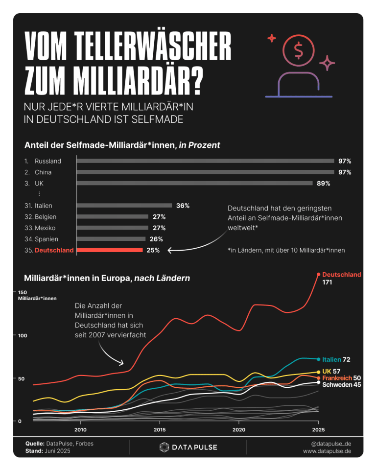

# 01/25 -- Newsletter des J.Ä.G.E.R e.V.

Auch dieses Jahr war viel los & wir möchten gemeinsam einordnen.

## Tier des Jahres

Der Alpenschneehase ([Lepus timidus varronis](https://www.deutschewildtierstiftung.de/wildtiere/schneehase)) ist das Tier des Jahres 2025, wie die *Deutsche Wildtierstiftung* bekannt gab. Das extrem seltene Tier kommt ausschließlich in einem kleinen Gebiet vor und leidet unter der Veränderung des Lebensraums durch den Klimawandel.

## Schnitzelverbot

Im Oktober stimmte das Europaparlament dafür, dass Fleischersatzprodukte in Zukunft nicht mehr die Bezeichnungen der entsprechenden Fleischlebensmittel tragen dürfen. Diese Entscheidung ist allerdings noch nicht endgültig, das Parlament tritt nun in Verhandlungen mit den 27 EU-Staaten. Die EVP-Fraktion, zu der auch CDU/CSU gehören, sieht unter anderem "Verwechslungsgefahr", lol. Dass es sich bei diesem Gesetzesvorhaben um populistischen Kulturkampf und eine perfide Anbiederung an Rechtsaußen handelt, ist offensichtlich. Warum solche Kreise Veganismus derart verteufeln, bleibt schleierhaft. Ihre tolle Erde wird nämlich auch zugrunde gehen, wenn der Klimawandel und dessen Auswirkungen, wie vermehrte Extremwetterereignisse, übers Land ziehen. Die Produktion von Fleisch hat nämlich eine enorm große Landnutzung und blockiert damit Flächen zur Denaturierung oder Wiederaufforstung.

## Dies & das

Zum Abschluss noch zwei interessante Funde von Timo. Zunächst stellen wir fest: Es gibt erstaunlich viele Milliardäre in Deutschland, hm. Details zur Methodik sind [hier](https://www.datapulse.de/milliardaere/) zu finden.

Und der Neoliberalismus und Christian haben die [Verstaatlichung des Stromnetzes in Deutschland verhindert](https://www.geldfuerdiewelt.de/p/tennet-tragodie-habeck-hatte-recht), wodurch Stromkunden in Zukunft die Rendite ausländischer Fonds zahlen.

Wie immer, alles Liebe und seid schön brav.
