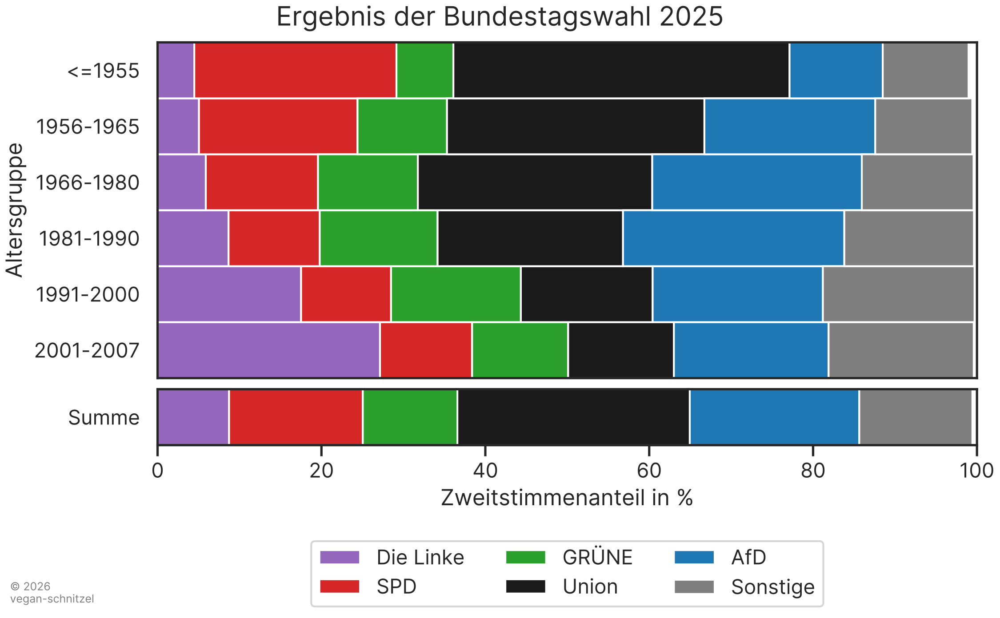

# 01/26 -- Newsletter des J.Ä.G.E.R e.V.

Herzlich willkommen zur Osterausgabe des Newsletters. Wir hoffen, es ist für alle etwas Spannendes dabei!

## Tier des Jahres

Der Rothirsch ist das Tier des Jahres 2026, wie die *Deutsche Wildtierstiftung* [bekannt](https://www.deutschewildtierstiftung.de/naturschutz/tier-des-jahres) gab. Der Rothirsch ist das größte Landsäugetier, das „regelmäßig bei uns in Deutschland lebt“. Die männlichen Tiere können bis zu 250 Kilogramm schwer werden.

## Rückblick auf die vergangene Bundestagswahl

Am 23. Februar letzten Jahres wurde gewählt. Im Rückblick auf das Wahlergebnis nach Altersgruppen fallen zwei Dinge auf:

- *Die Linke* ist stärkste Kraft bei den Jungwähler:innen (vor allem bei jungen Frauen, nicht Teil der Grafik), dafür leider die *AfD* bei den etwas Älteren.
- Junge Menschen sind stark politisiert und wählen eher die sogenannten „Ränder“, die traditionelle „Mitte“ verschwindet.

## PRÜF

*PRÜF* steht für „Prüfung Rettet Übrigens Freiheit!“. *PRÜF* ist ein überparteiliches Bündnis, das jeden zweiten Sonntag im Monat Demonstrationen in (fast allen) Landeshauptstädten organisiert. Weitere Informationen sowie die Kernforderung des Bündnisses finden sich auf dessen [Website](https://pruef-demos.de/):

> **„Alle Parteien, die vom Verfassungsschutz als rechtsextremer Verdachtsfall oder gesichert rechtsextrem eingestuft werden, sollen durch das Bundesverfassungsgericht überprüft werden.“**

## Netzpolitik

- Nachdem das US-Unternehmen *Anthropic* dem Pentagon untersagt hat, ihre KI *Claude* für Massenüberwachung und autonome Waffensysteme zu nutzen, hat innerhalb von Stunden Sam Altman, der CEO von *OpenAI*, dem Pentagon stattdessen die Nutzung von *ChatGPT* angeboten. Außerdem ist der Präsident von *OpenAI*, Greg Brockman, ein Großspender von Donald Trump. Obwohl KI natürlich grundsätzlich einige Probleme mit sich bringt, lohnt sich der unkomplizierte Wechsel zu einem alternativen Chatbot, wie [hier](https://quitgpt.org/) beschrieben. Als einfachsten Umstieg empfehle ich [*Claude*](https://claude.ai).
- Jeden ersten Sonntag im Monat ist **Digital Independence Day**! Heutzutage ist es wichtiger den je, digital unabhähnig zu sein. [Wechselrezepte](https://di.day/de/wechselrezepte) helfen beim Umstieg auf datenschutzkonforme und demokratiefreundliche digitale Alternativen: Zum Beispiel der [Wechsel von *Paypal* zu *Wero*](https://di.day/de/wechselrezepte/wero).

Das war’s erst mal. Lasst euch nicht ärgern, sondern ärgert die anderen. Bis zum nächsten Mal.